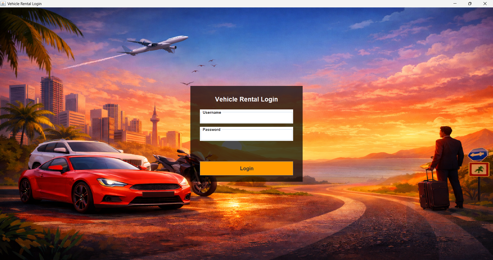
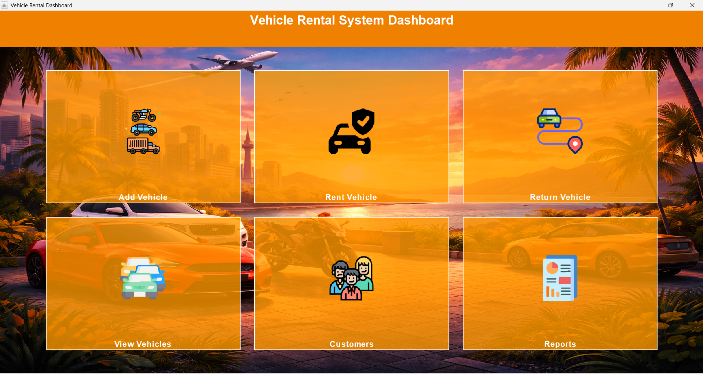
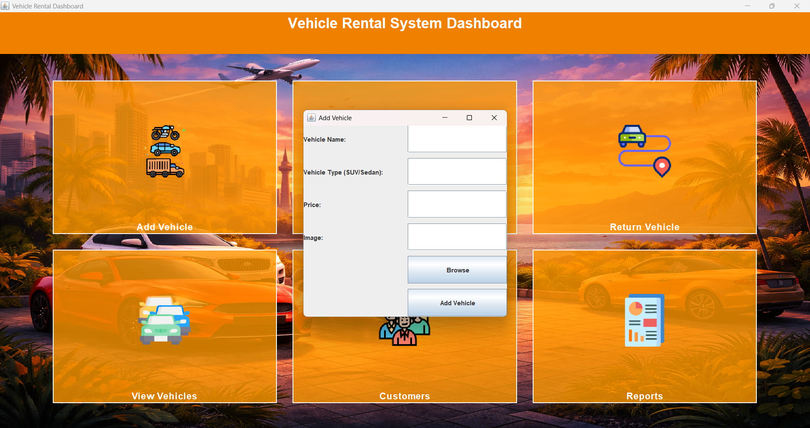
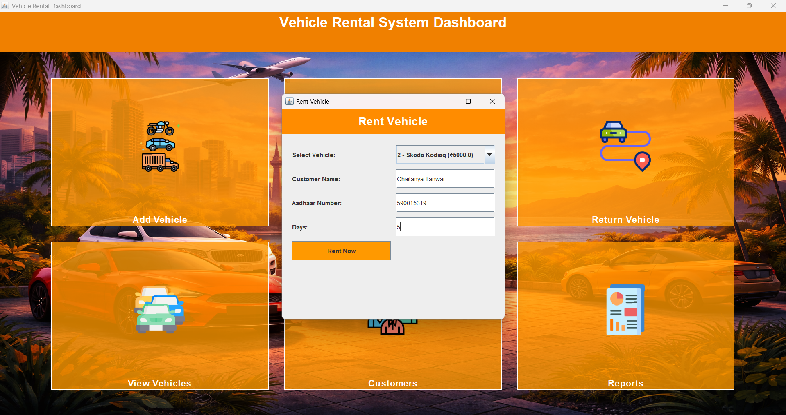
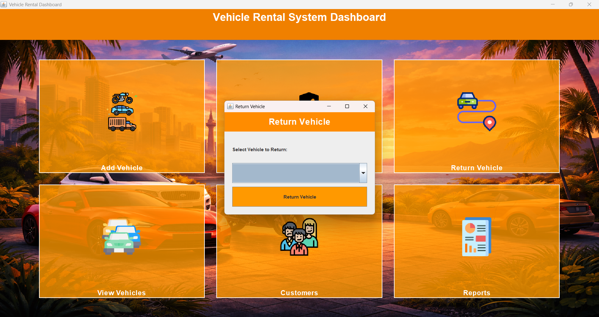
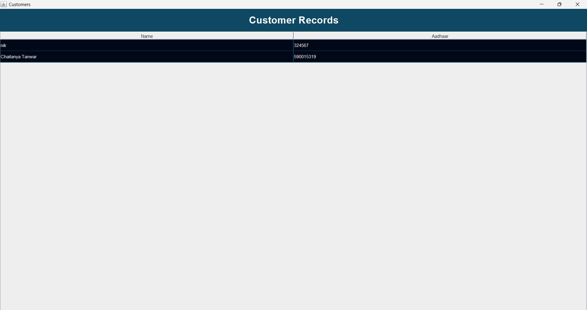

# Phase 4: UI and Integration

## 1. Overview

The system provides a Java Swing-based graphical user interface that allows users to interact with the vehicle rental system.

The UI is fully integrated with the service layer and data storage, enabling complete workflows such as adding vehicles, renting vehicles, returning vehicles, and viewing records.

---

## 2. Main Screens

- Login Screen
- Dashboard
- Add Vehicle
- Rent Vehicle
- Return Vehicle
- Records

---

## 3. Integration Flow

User Action → GUI → Service Layer → FileUtil → Data Storage

- GUI handles user input
- Service layer processes business logic
- FileUtil manages data persistence

---

## 4. Implemented Workflow

1. User logs into the system
2. User adds a vehicle
3. User rents the vehicle
4. System updates availability
5. User returns the vehicle
6. System updates records

---

## 5. Validation

- System prevents renting unavailable vehicles
- Input validation is handled before processing
- Errors are displayed through UI

---

## 6. Screenshots

### Login Screen

### Dashboard

### Add Vehicle

### Rent Vehicle

### Return Vehicle

### Records

